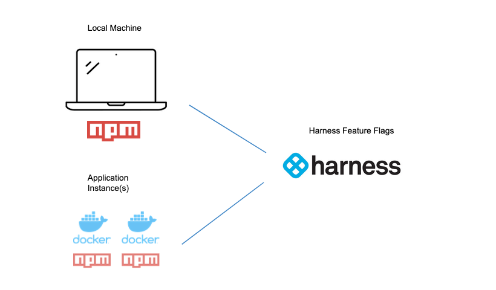
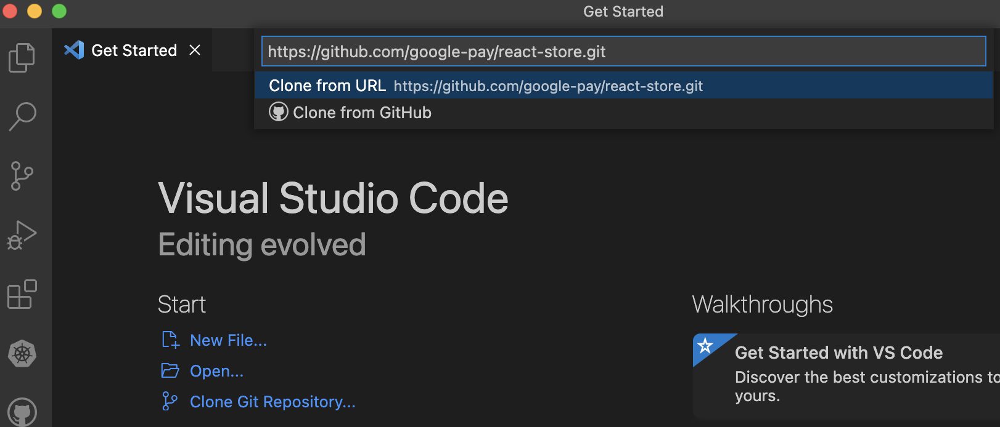
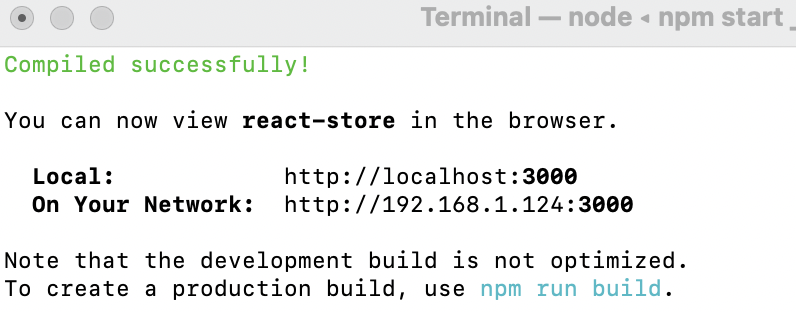
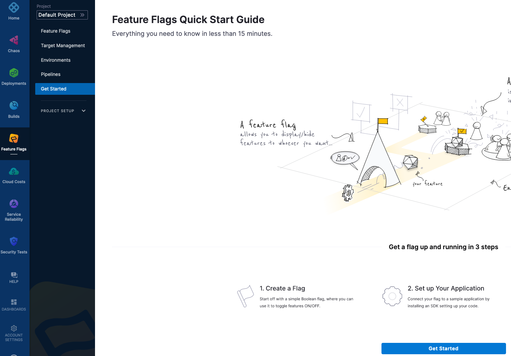
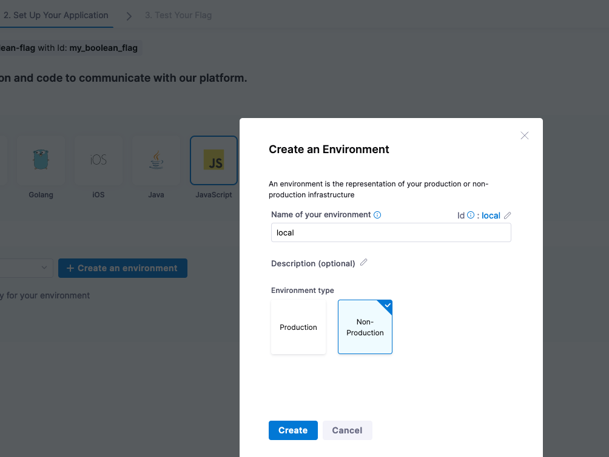
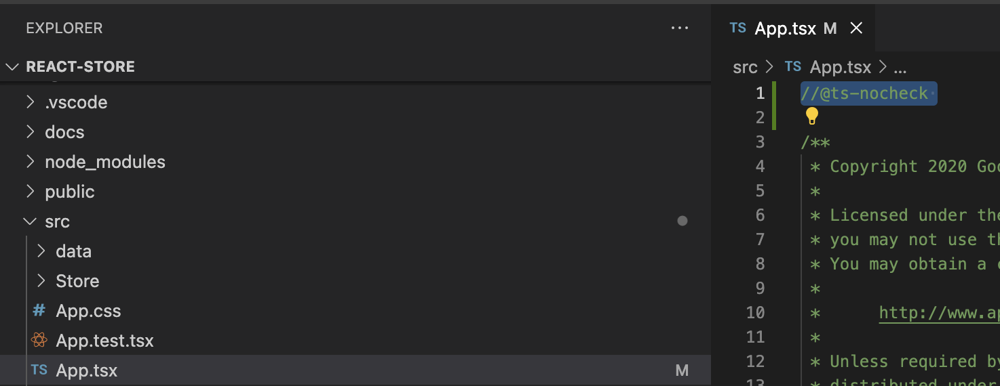
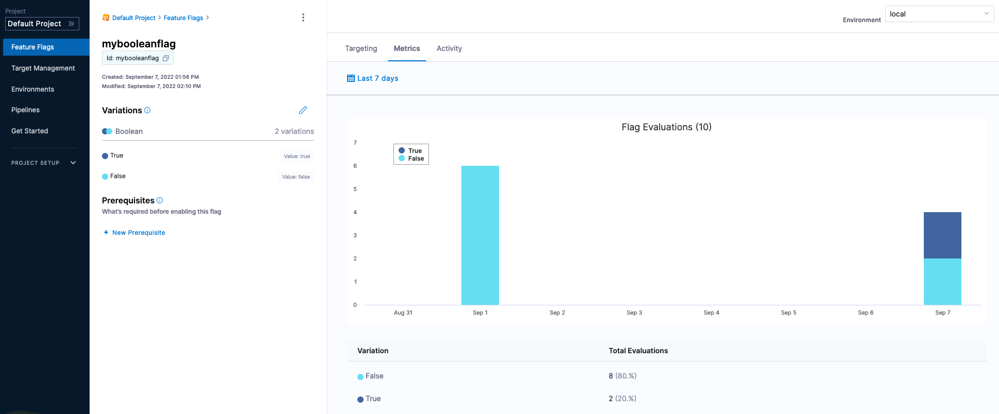

# JavaScript Feature Flags - TypeScript and React

## Background on Feature Flags

It takes two things to build software; teamwork and iteration. As software engineers, we dive into creating the unknown, sometimes for the first time. Core to innovative work is experimenting and prototyping as incremental success builds greater success. As changes near production, the experimentation that was appropriate in lower environments tapers off as the potential blast radius grows, e.g. if we get the experiment wrong, there’s a greater impact on a larger number of users.

[Feature Flags](https://harness.io/blog/what-are-feature-flags) by definition allow blocks of code to be executed conditionally. Conditional statements are nothing new and have been around for several decades; the management of inventorying and toggling these conditional statements are newer and Feature Flag platforms are here. Feature Flags enable a concept called Progressive Delivery, or the incremental release of features. In this example we will walk you through your first Feature Flag creation and execution.

## What You Need For Executing Your First Feature Flag

Feature Flags have a close relationship with the code base since they surround/decorate conditional statements. You’ll need to include a Feature Flag SDK as a dependency then wire the Feature Flag client. To support this, the underlying code base and necessary dependencies to build/run the code base is needed. If this is your first time leveraging a Feature Flag, [Google’s React Store](https://github.com/google-pay/react-store) is a great sample app to modify and use with Harness Feature Flags. This example will require a GitHub Account, an editor such as an IDE, a [Harness Feature Flags Account](https://app.harness.io/auth/#/signup/?module=cf), and the ability to run an [NPM Install](https://docs.npmjs.com/cli/v7/commands/npm-install) in your local or remote environment.



## Running The Example App Locally

Locally running Google's React Store app is simple. The first step is to clone the repository on your machine, leveraging Git clone:

`git clone https://github.com/google-pay/react-store.git`

Or import the repository from an IDE such as VS Code:



Once cloned/downloaded to your machine, you can follow the [project instructions](https://github.com/google-pay/react-store#readme) to start. The only requirement is that you have NPM installed on your machine. If you don’t have NPM:

- On a Windows machine you can use [Chocolatey](https://chocolatey.org/install) to install:
  `choco install nodejs`
- On a Mac, you can install using [Homebrew](https://brew.sh/):
  `brew install node`

In the root of the project, run npm install, then npm start, and then head to [http://localhost:3000](http://localhost:3000).

```
#root of react-store directory
npm install
npm run
```



Heading to your localhost URL, you can see the vanilla instance of the React Store.


Now you are ready to flag pieces of functionality inside the React Store. You can stop the NPM server by hitting _ctrl+c_, so as you make modifications, the just-in-time changes are not propagated until you are ready.

## Getting Your Application Ready For Harness Feature Flags

If you haven’t already, [sign up for a Harness Feature Flags account](https://app.harness.io/auth/#/signup/?module=cf&?utm_source=website&utm_medium=harness-developer-hub&utm_campaign=ff-plg&utm_content=get-started). Creating and executing a Feature Flag for the React app is pretty straightforward. Depending on your language, Feature Flags requires the use of a corresponding SDK (software development kit), which is installed as a dependency in your application. Since this example application is React, we can leverage the [JavaScript Feature Flags SDK](https://docs.harness.io/article/bmlvsxhp13-java-script-sdk-references). We will be creating a simple boolean flag that will evaluate either true or false.

### Adding the Feature Flags SDK To The Project

The easiest way in the example application is to just include the dependency in the package.json, which is “@harnessio/ff-javascript-client-sdk”: “^1.4.10”. Navigate to the package.json and add the JS Client as a dependency.

`"@harnessio/ff-javascript-client-sdk": "^1.4.10",`


Once added, make sure to save and re-run `npm install`.


With the dependency installed, head to Harness Feature Flags to create your first Feature Flag.

## Creating Your First Feature Flag

Head to the Harness Platform and navigate to the Feature Flags module. Here you will generate a client SDK Key to communicate with the Harness Feature Flags platform. If this is your first time in the Harness Platform, a default Harness Project [grouping of your project assets] will be created for you. For this example, the default Harness Project is fine.

Harness -> Feature Flags -> Get Started, then click Get Started.



On the next screen, you will name your first Feature Flag and select the language the Feature Flag will use.

- Flag Name: mybooleanflag
- Language: JavaScript


Harness has a concept of Environments, which is target infrastructure or where your application will be running. When selecting the language, create a new Environment.

- Environment Name: local
- Environment Type: Non-Production



Click **Create**, and then create a new SDK Key by clicking on **+ Create SDK Key**.

As JavaScript is a client-side SDK, make sure to select a client SDK key.

Give the SDK Key a name such as “my-js-sdk-key” and click **Create**.

An SDK Key will be created for you and scaffolding code will be generated to populate your application.

The SDK Key e.g. for this example is 6d467636-d27a-4000-904a-1fedde695133


Now you’re ready to wire the application to leverage the Feature Flag.

## Wiring Your Source Code for Feature Flags

There needs to be wiring at the source code level so the application can communicate with Harness Feature Flags.

A good spot to initialize the client is a common module. In the React Store, the **App.tsx** is a TypScript header that is used across the application and would be a good place to wire in the SDK client.

The linting rules on this project can be strict, so can disable the linting rules by adding `//@ts-nocheck` to the top of the file located at _react-store/src/App.tsx_.



The next step is to import the client as part of the import statements. The import statement and other code snippets are available in the Feature Flags UI and the [Documentation](https://docs.harness.io/article/bmlvsxhp13-java-script-sdk-references).


In this example, the wiring into App.tsx is the third import:

`import { initialize, Event } from '@harnessio/ff-javascript-client-sdk';`


The below code will leverage a React Effect Hook (e.g. useEffect) to initialize the SDK, wire to the platform, and listen for events (e.g. changes in the Flags). Update your identifier and client-sdk-key.

Identifier: mybooleanflag
SDK Key: e.g 6d467636-d27a-4000-904a-1fedde695133

```
useEffect(() => {
    const cf = initialize(
        '6d467636-d27a-4000-904a-1fedde695133',
        { identifier: 'mybooleanflag', attributes: { lastUpdated: Date(), host: window.location.href } },
        { baseUrl: 'https://config.ff.harness.io/api/1.0', eventUrl: 'https://events.ff.harness.io/api/1.0' }
    );
    cf.on(Event.READY, (flags) => {
        setFeatureFlags(flags);
        console.log(flags);
    });
    cf.on(Event.CHANGED, (flagInfo) => {
        console.log(flagInfo);
        if (flagInfo.deleted) {
            setFeatureFlags((currentFeatureFlags) => {
                delete currentFeatureFlags[flagInfo.flag];
                return { ...currentFeatureFlags };
            });
        } else {
            setFeatureFlags((currentFeatureFlags) => ({ ...currentFeatureFlags, [flagInfo.flag]: flagInfo.value }));
        }
    });
    return () => {
        cf?.close();
    };
}, []);
```


With the SDK wired in and listening for events, now you can start wrapping items in Feature Flag evaluations.

## Wrapping Code with a Feature Flag Evaluation

The crux of a boolean Feature Flag evaluation is to have blocks of codes enabled or disabled based on a condition. Making a change to the UI is a quick way to see how a Feature Flag evaluates. In this example, let’s modify some CSS to change based on an expression.

With a let expression in TypeScript, can evaluate if “my-boolean-flag” is true or false and set a variable, a CSS Class Name, based on the expression.

In App.tsx, add a let expression before the function return.

`let className = featureFlags.mybooleanflag ? 'App.Left' : 'App';`


In the return section of App.tsx where the `<div>` class is set, you can update that to be a variable e.g. className vs the static “App” class.

`div className={className}`


Lastly, add the new App.Left CSS element into App.CSS.

`.App.Left { text-align: left;}`


With the expression and SDK wired in to monitor for changes in events, you are now ready to execute the Feature Flag.

## Executing Your First Feature Flag

You are now ready to run your first Feature Flag. As a note, this project is an example project to teach **strict** stylistic guidelines in TypeScript. You can disable the [Prettier plugin](https://prettier.io/tutorials/en/plugins.html) in the eslintrc config by adding a Prettier rule. You can also remove the “sort-imports” rule if your IDE did not take care of sorting the imports for you, e.g. when you added the init import statement.

```
"prettier/prettier": 0,
/** Remove "sort-imports": "error" */
```


With additional linting suppressed, you are now ready to run the application.

### Exploring Feature Flags

For safety, you can re-run `npm install`, then execute `npm run`, and then you can start evaluating your first Feature Flag.

Head to localhost:3000 and validate the base state of the application.


Back in the Feature Flag Module, click **Verify**, and then enable/toggle “mybooleanflag”. The SDK should communicate back with Harness and will get a status message stating such.


Head back to localhost:3000 and check out your UI change.


Congratulations on your first Feature Flag! If you want to get some stats/metrics on what has been executed, you can head back to the Harness Platform.

Harness -> Default Project -> Feature Flags -> mybooleanflag



This is just the start with Feature Flags - there are so many more scenarios for improving your code and processes by leveraging them, such as multivariate and targeted flags, and infrastructure related flags.
