# Customize Delegate to Run Your Favorite Third Party Tools

Harness Delegate is a service you run in your local network or VPC to connect your artifacts, infrastructure, collaboration, verification and other providers with Harness Manager.
The first time you connect Harness to a third-party resource, Harness Delegate is installed in your target infrastructure, for example, a Kubernetes cluster. 
After the Delegate is installed, you connect to third-party resources. The Delegate performs all operations, including deployment and integration.
In this tutorial, we will show you how to install the Harness Delegate first and then how to customize it to run your favourite tools. 

## Prerequisites
- A free [Harness cloud](https://app.harness.io/auth/#/signup/utm_source=website&utm_medium=harness-developer-hub&utm_campaign=cd-plg&utm_content=get-started) account 
- A deployment target such as Kubernetes cluster. You can use Minikube or Kind to create a cluster. We will be using a cluster from Google Cloud in this tutorial.
  
### Tutorial
Once you signup for the Harness cloud account. You will have to create a project.
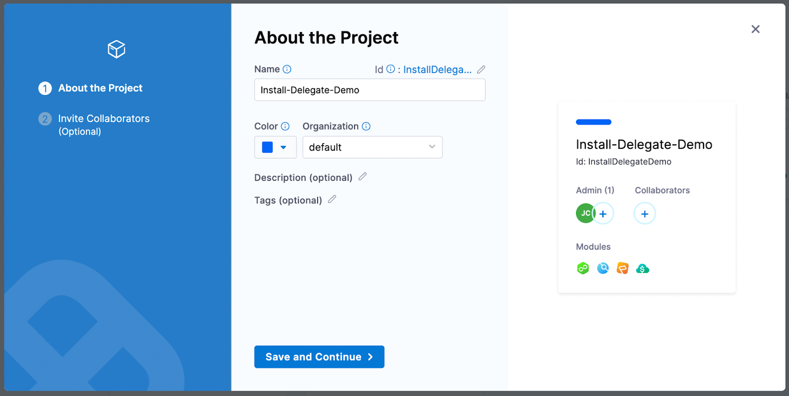

Invite collaborators for your project if you want or else you can just save and continue.


Next, you need to pick a Harness module from the list of modules shown to you. We will select Continuous Delivery as our module.
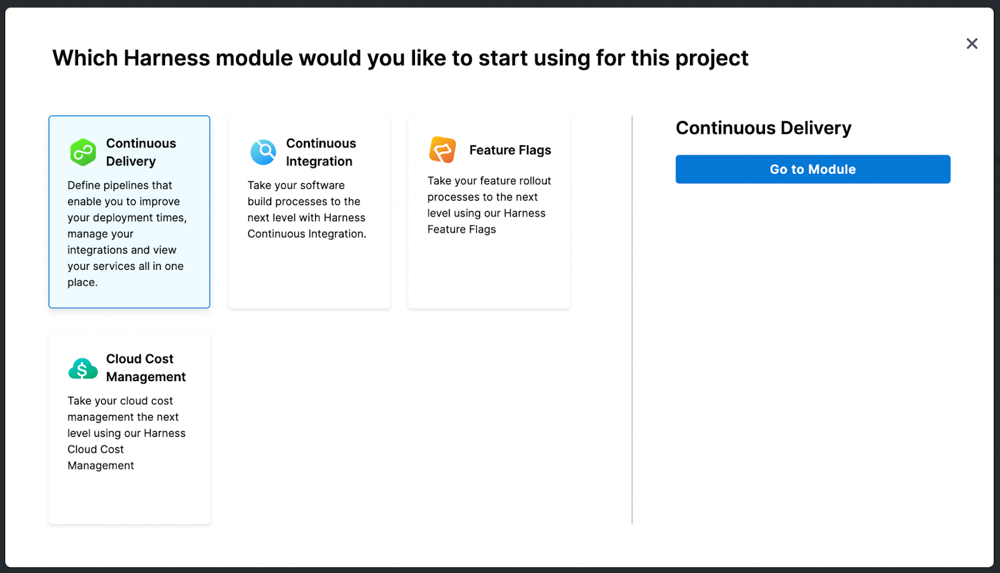

You can start creating your first continuous delivery (CD) pipeline. 


Our first and primary step is to install a Delegate to perform any pipeline activities. Hence, once you click ‘Get Started’ from the above step, you will be presented with the next step, where you will have to install the Delegate.  

Decide where you want to install your Delegate. You have two options ‘Kubernetes’ or ‘Docker’. In this tutorial, we will select ‘Kubernetes’, 


Once you select ‘Kubernetes’ as the target to install your Delegate, you will get a set of simple instructions to follow and verify your Delegate installation. 
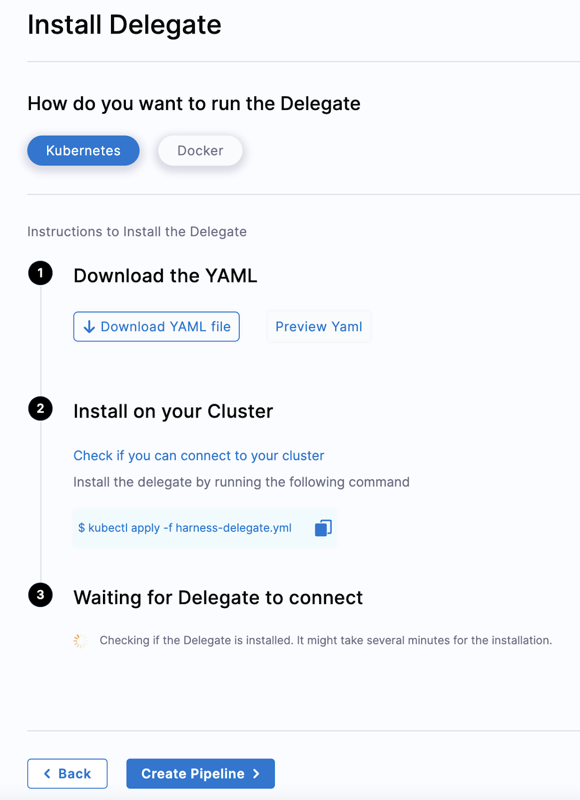

The first thing you need to do is to download the YAML file as stated and store it in your local machine and keep a note of the location you have stored it. 

Next, make sure your Kubernetes cluster is up and running. As we have stated in the prerequisites, you can create a cluster from any cloud provider or even use Minikube or Kind. 

We have our cluster created on Google Cloud (GCP). As shown in the 2nd point, we need to run the kubectl apply command,
 `kubectl apply -f harness-delegate.yml`

[Make sure you are running this above command in the right path. You need to run it in the same path where you stored your harness-delegate.yml file]

Once you run the above command, you can see a bunch of configurations getting created. 


Now, you can go back and check the status of your Delegate. After a minute or two, you should see a successful Delegate installation message. 
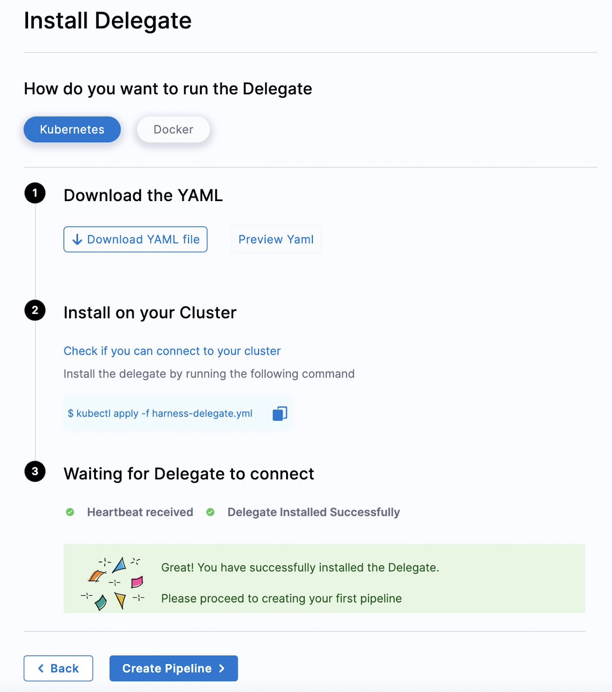

Congratulations!!! You installed Harness Delegate successfully and are now ready to perform the great pipeline activities. 

## Let’s Customize Our Delegate
### Install Git:
If you check your Delegate, it is written in a YAML format. We can add custom scripts and customize our Delegate accordingly. You can have Git, Helm, Terraform, PowerShell, Docker, AWS CLI, etc., installed on top of your Delegate so you can run any related commands. 

Check your downloaded Delegate YAML file and look for the `INIT_SCRIPT` location.


You need to add your custom script at this place and install anything on top of the Delegate.

Let’s install Git on top of our Delegate. For this, we need the following script to be added below the `INIT_SCRIPT` 

`apt-get update 
yes | apt-get install git`

Let’s add it
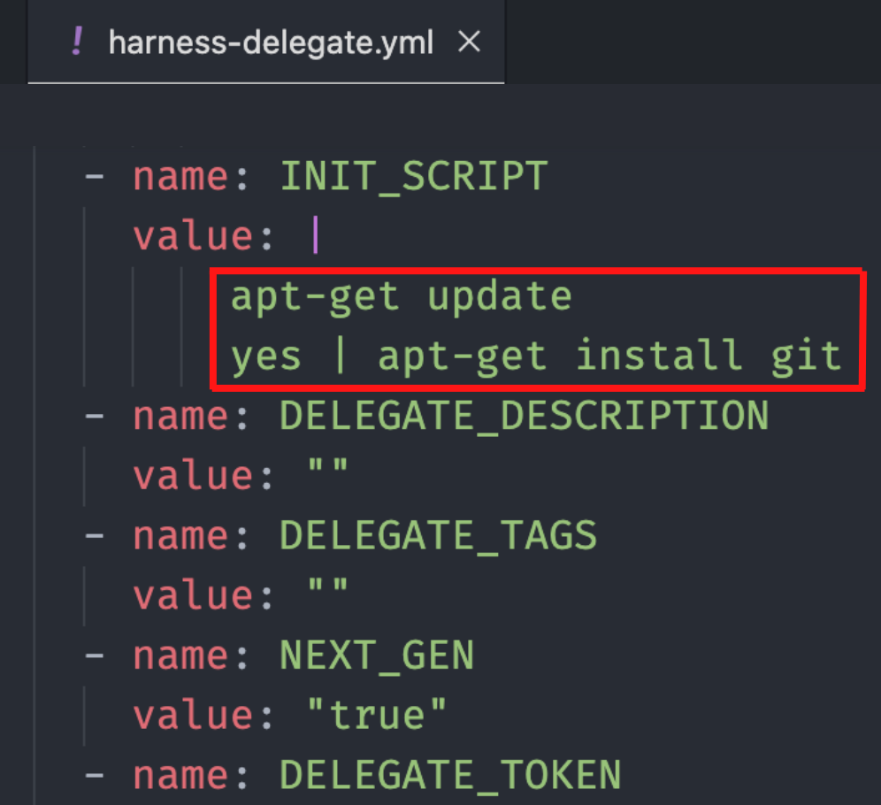

Save the above configured Delegate YAML and run the kubectl command to apply it

`kubectl apply -f harness-delegate.yml`

You should see the Delegate up and running in a minute or two.


Let’s create a pipeline and add a custom stage
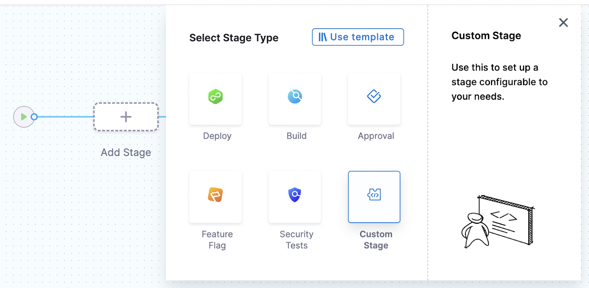

Add a step and select Shell Script from the options.
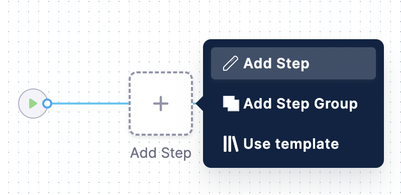


Let’s add the command to check the Git version installed on the Delegate.

Add the command `git --version` in the Script tab. 
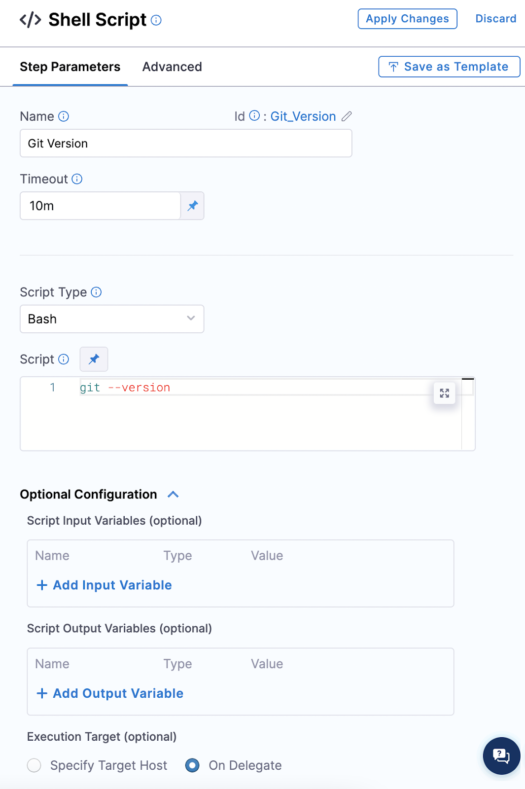

Make sure the Execution Target is set to On Delegate. 

In the advanced tab, select the Delegate that is running and where your Git is installed.
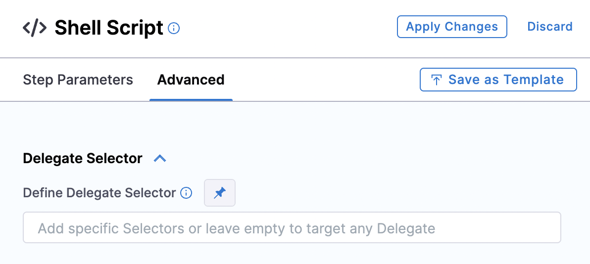

Now, apply changes, save everything and run the pipeline.
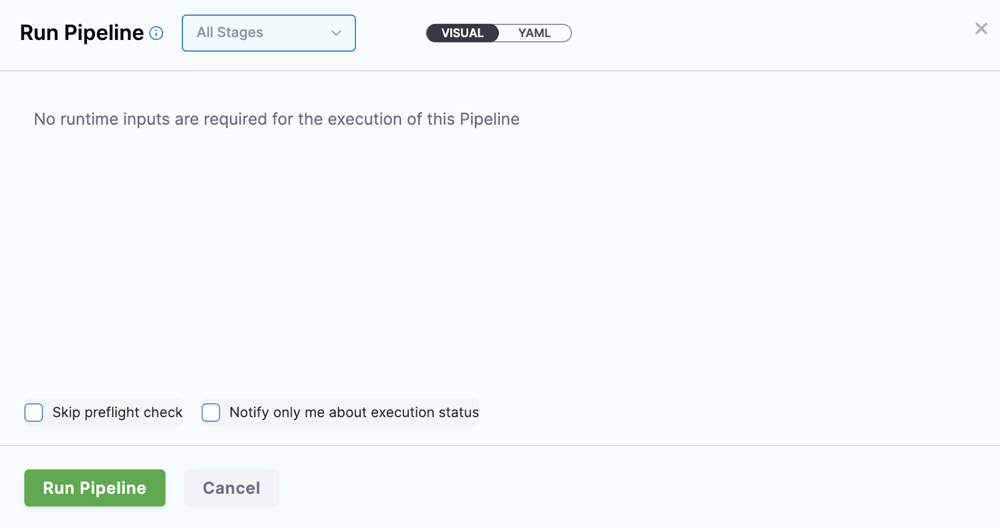

You should see the Git command execution. 


Now, you can use any Git commands as part of your project. 

### Install AWS CLI:
You can add the AWS CLI tooling on your Delegate just the way we added Git.

Here is the AWS CLI script to add into our INIT_SCRIPT section
```
curl "https://awscli.amazonaws.com/awscli-exe-linux-x86_64.zip" -o "awscliv2.zip"
unzip awscliv2.zip
./aws/install
```
You can see the screenshot below for more clarity, 


Let’s add the shell script as a step just like how we added Git.

In the Script, add the command `aws –version`
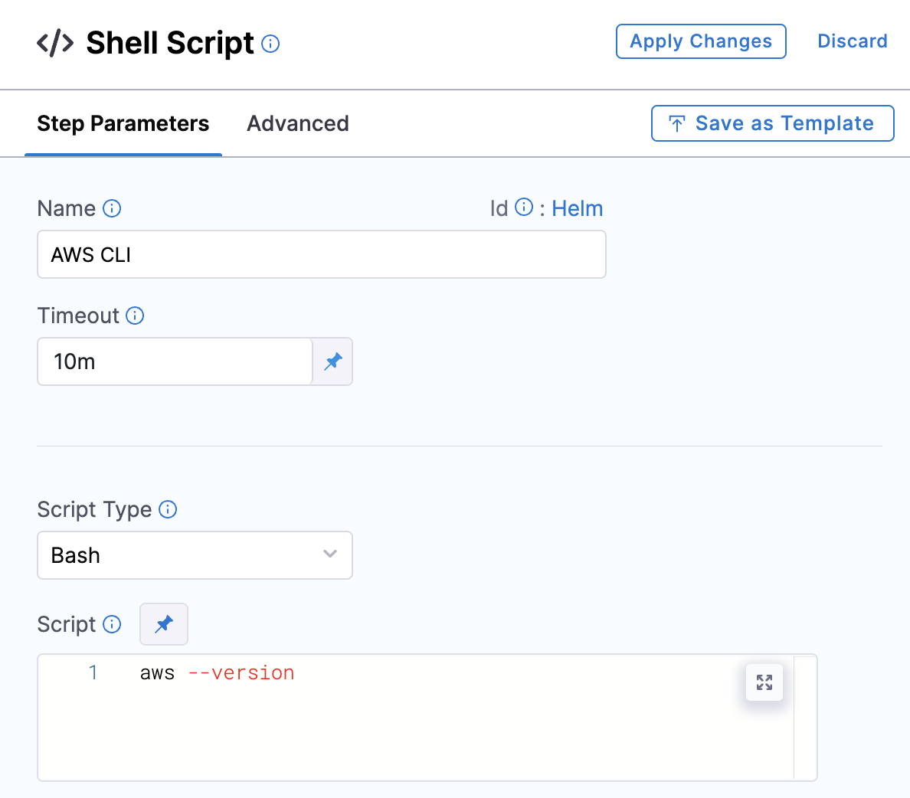

Also, specify the Delegate in the advanced settings.
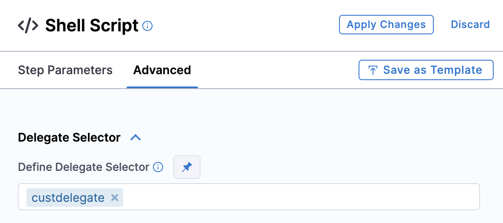

Save everything and run the pipeline. 

You can see the AWS CLI version.

### Install Kubectl:
Add the following script into your script and apply the yaml just like how we did previously.
```
curl -L0 https://dl.k8s.io/release/v1.24.3/bin/linux/amd64/kubectl -o kubectl  
chmod +x ./kubectl  
mv kubectl /opt/harness-delegate/custom-client-tools/kubectl
```
See the screenshot below for more clarity.

Save the yaml and apply the kubectl command for the Delegate.

Add the shell script step as shown below with the `kubectl version` command.


Also, specify the Delegate in the Advanced tab in the above step.
Save everything and run the pipeline.


You can see the Kubectl version getting displayed. 

### Install Terraform:

Add this script under the `IN_IT` section
```
curl -O -L  https://releases.hashicorp.com/terraform/0.12.25/terraform_0.12.25_linux_amd64.zip  
unzip terraform_0.12.25_linux_amd64.zip  
mv ./terraform /usr/bin/  
```
Save the yaml and apply the kubectl command for the Delegate.

Add the shell script step as shown below with the `terraform --version` command.
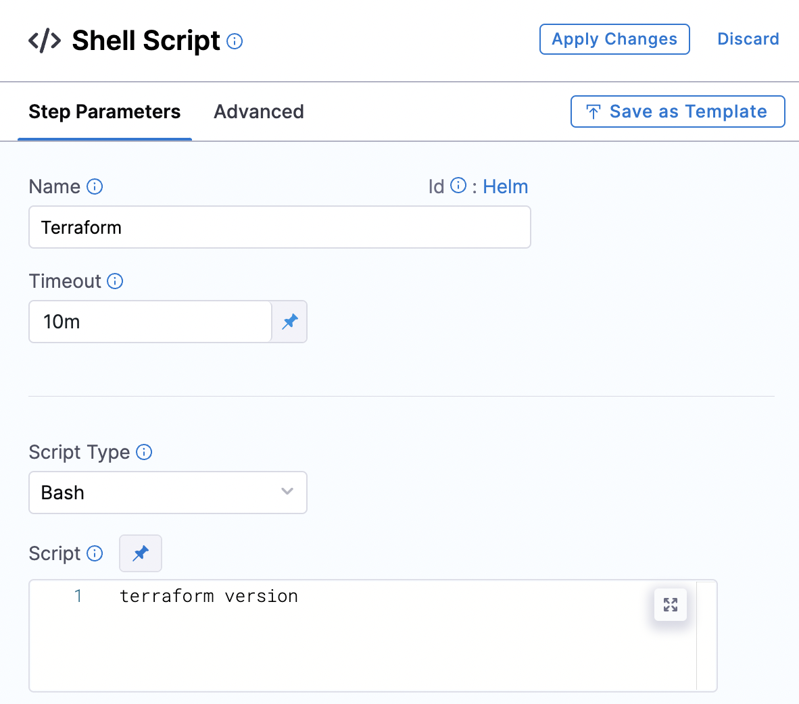

Also, specify the Delegate running in the advanced tab you see above.

Apply changes, save everything and run the pipeline and you should see the Terraform version output displayed as expected.


### Install Helm:
The IN_IT script to add to install Helm 3 is given below,

curl -fsSL -o get_helm.sh https://raw.githubusercontent.com/helm/helm/main/scripts/get-helm-3  
chmod 700 get_helm.sh  
./get_helm.sh

Save the yaml and apply the kubectl command for the Delegate.

The command to use to verify whether the Helm is stalled or not is ‘helm version’


Apply changes and run the pipeline to see the Helm version getting displayed if everything went well.


Let’s verify if we can deploy our charts.

In the Shell Script, replace the existing command with the one that is shown below
```
helm create my-new-chart
helm install my-new-chart ./my-new-chart
helm ls
```
Apply changes, save the configuration and run the pipeline. You should see your chart deployed successfully.


### Install All At Once:
Now, let’s combine all the tools and add them all in the `IN_IT` script. 
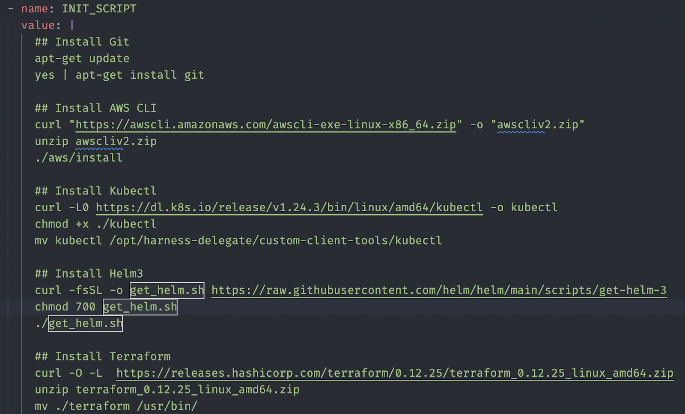

Save the yaml and apply the kubectl command for the Delegate.

You can either create everything from one step or create separate steps for each tool. In this tutorial, we have created separate steps for each tool.


Save the configuration and run the pipeline and you should see the successful output with displaying different tools version number. 


This way, you can install and play with any of your favorite tools on Harness Delegate. This customization gives a lot of flexibility to developers working with these tools.  

#### Get started with [*Harness Delegate*](https://developer.harness.io/docs/category/delegates/?utm_source=website&utm_medium=harness-developer-hub&utm_campaign=cd-plg&utm_content=get-started) today!