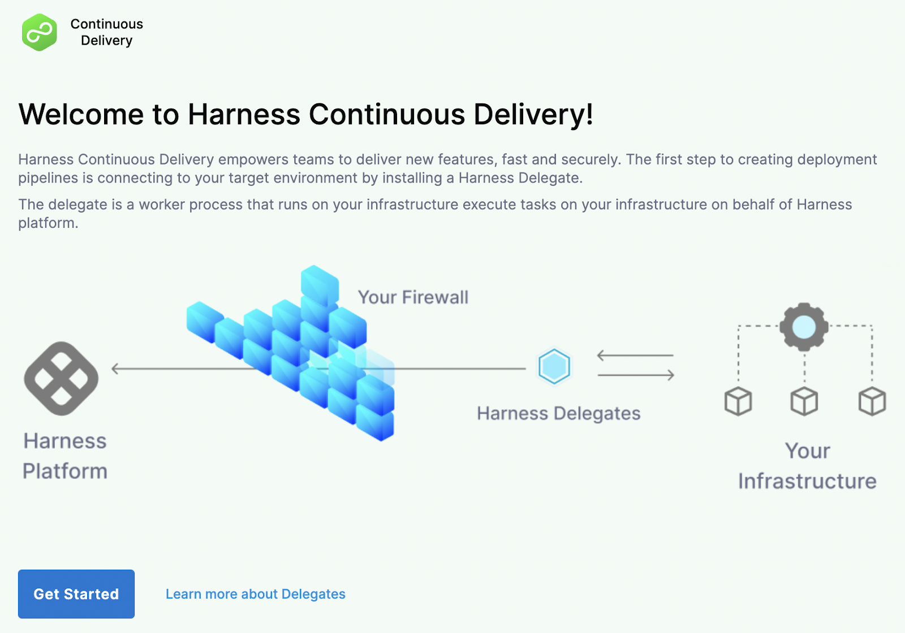
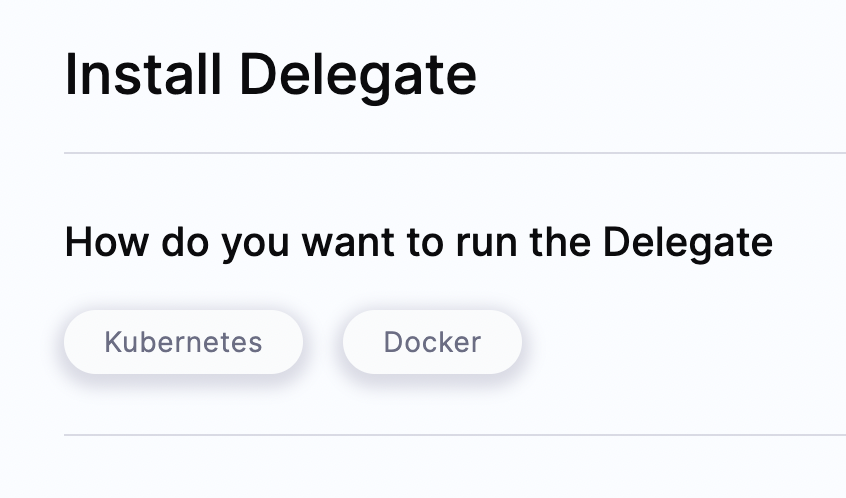
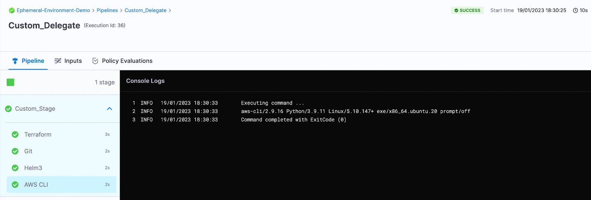

# Customize the delegate to run your favorite third-party tools

Harness Delegate is a service you run in your local network or VPC to connect your artifacts, infrastructure, collaboration, verification and other providers with Harness Manager. The first time you connect Harness to a third-party resource, Harness Delegate is installed in your target infrastructure, for example, a Kubernetes cluster. With the delegate installed, you can connect to third-party resources. The delegate performs all pipeline operations, including deployment and integration.

In this tutorial, we'll show you how to install Harness Delegate, and how to customize the delegate to run your favorite tools. 

## Prerequisites

- A free [Harness cloud](https://app.harness.io/auth/#/signup/utm_source=website&utm_medium=harness-developer-hub&utm_campaign=cd-plg&utm_content=get-started) account 
- A deployment target such as Kubernetes cluster. You can use Minikube or Kind to create a cluster. In this tutorial, we'll use a cluster that was created on Google Cloud.
  
### Tutorial

Now that you've got a Harness cloud account, you can create a project.


You can start by inviting collaborators to work with you, or you can click **Save and continue**. 


Next, pick a Harness module for your project. Click the **Continuous Delivery** card.


Now you can create your first Continuous Delivery (CD) pipeline. 



The major part of the work we're going to do is to install a delegate to perform pipeline activities. Click **Get Started**, and we'll move on to delegate installation.

Decide where to install your delegate. This is your target. 

You have two options: ‘Kubernetes’ or ‘Docker’. In this tutorial, we'll install the delegate on ‘Kubernetes’, 



After you choose your target &mdash; in this case, Kubernetes &mdash; you'll see the steps you need to use to install and verify the delegate. 


The first thing you need to do is to download the YAML file and store it on your local machine. Keep a note of where you store it. 

Next, make sure your Kubernetes cluster is up and running. You can use a cluster from any cloud provider. You can also use a cluster you install on your laptop with Minikube or Kind. 

We're going to install the delegate on a cluster that was created on Google Cloud Platform (GCP). We'll apply the YAML to the cluster by running the `kubectl apply` command from the directory that contains the harness-delegate.yml file.

 `kubectl apply -f harness-delegate.yml`

Make sure you run this command from the right path. It must be run from the directory location of your harness-delegate.yml file.

This command triggers the creation of a bunch of configurations. 


When the work is done, you can go back and check the status of your delegate. You should see an installation success message within a few minutes. 


Congratulations! Harness Delegate is installed and ready to carry out the work of your pipeline. 

## Let’s customize our delegate

Now let's run through some customizations of the delegate.

### Install Git

Your delegate is declaratively defined in YAML. This makes it easy to add custom scripts and customize the delegate in other ways too. You can have Git, Helm, Terraform, PowerShell, Docker, AWS CLI, and other tools installed with your delegate, so there's a lot you can do. 

Open the delegate YAML file and look for the location of the `INIT_SCRIPT'.


You'll need to add your custom scripts to this location and install any utilities on top of the delegate.

Let’s begin by installing Git on the delegate. We'll need to add the following script as the value of the `INIT_SCRIPT` field: 

`apt-get update 
yes | apt-get install git`

Let’s add it.


Save the above configured Delegate YAML and run the kubectl command to apply it

`kubectl apply -f harness-delegate.yml`

You should see the delegate up and running in a minute or two.


Let’s create a pipeline and add a custom stage


Add a step and select **Shell Script** from the options.


Let’s add the command to check the Git version installed on the delegate.

Add the command `git --version` in the Script tab. 


Make sure the Execution Target is set to **On Delegate**. 

In the **Advanced** tab, select the delegate that's running and where Git is installed.


Now, apply your changes, save everything, and run the pipeline.


You should see the Git command execution. 


Now, you can use any Git command in your project. 

### Install AWS CLI

You can add AWS CLI tooling to your delegate the same way we added Git.

Here is the AWS CLI script to add into our `INIT_SCRIPT` section:

```
curl "https://awscli.amazonaws.com/awscli-exe-linux-x86_64.zip" -o "awscliv2.zip"
unzip awscliv2.zip
./aws/install
```

See the screenshot below for more clarity.


Let’s add the shell script as a step the same way we added Git.

In the script, add the command `aws –version`


Also, specify the delegate in the advanced settings.


Save everything and run the pipeline. 


You can see the AWS CLI version.

### Install kubectl

Add the following script into your script and apply the YAML the same way we did before.

```
curl -L0 https://dl.k8s.io/release/v1.24.3/bin/linux/amd64/kubectl -o kubectl  
chmod +x ./kubectl  
mv kubectl /opt/harness-delegate/custom-client-tools/kubectl
```

See the screenshot below for more clarity.


Save the YAML and apply the `kubectl` command for the delegate.

Add the shell script step as shown below. Use the `kubectl version` command.


Make sure you specify the delegate on the **Advanced** tab of the step.

Save everything and run the pipeline.


The `kubectl` version information is displayed. 

### Install Terraform

Add this script to the `IN_IT` section:

```
curl -O -L  https://releases.hashicorp.com/terraform/0.12.25/terraform_0.12.25_linux_amd64.zip  
unzip terraform_0.12.25_linux_amd64.zip  
mv ./terraform /usr/bin/  
```

Save the YAML and apply the `kubectl` command.

Add the shell script step as follows. Use the `terraform --version` command.


Then specify the delegate that's running on the **Advanced** tab.

Apply your changes, save everything, and run the pipeline. You should see the Terraform version displayed in the output.


### Install Helm

The following `IN_IT` script installs Helm 3:

```
curl -fsSL -o get_helm.sh https://raw.githubusercontent.com/helm/helm/main/scripts/get-helm-3  
chmod 700 get_helm.sh  
./get_helm.sh
```

Save the YAML and apply the `kubectl` command to the delegate.

To check whether Helm is installed, use the ‘helm version’ command.


Apply your changes and run the pipeline. If all goes well, you'll see the Helm version information.


Let’s verify that we can deploy our charts.

In the Shell Script, replace the existing command with the following:

```
helm create my-new-chart
helm install my-new-chart ./my-new-chart
helm ls
```
Apply changes, save the configuration, and run the pipeline. Your chart should be deployed.


### Install all at once

Let’s combine all the tools and add them all to the `IN_IT` script. 


Save the changes and use `kubectl` to apply the YAML to the delegate.

You can create everything from one step or create separate steps for each tool. In this tutorial, we created separate steps for each tool.


Save the configuration and run the pipeline. On success, you should see output that includes the different tool version numbers. 



You can use these steps to install and play with any of your favorite tools on Harness Delegate. This customization gives you a lot of flexibility.  

#### Get started with [*Harness Delegate*](https://developer.harness.io/docs/category/delegates/?utm_source=website&utm_medium=harness-developer-hub&utm_campaign=cd-plg&utm_content=get-started) today!
