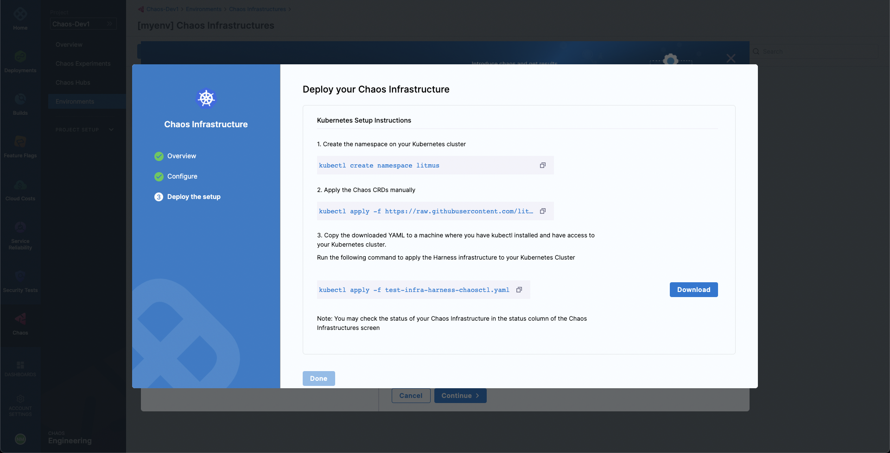
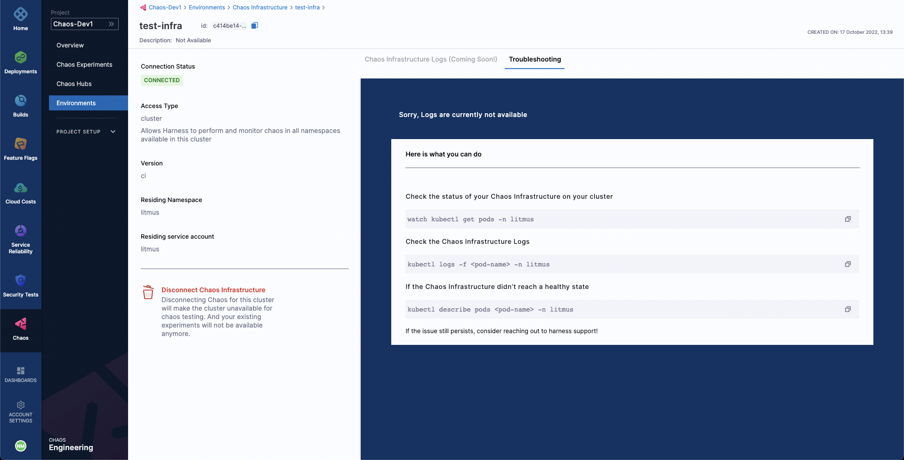
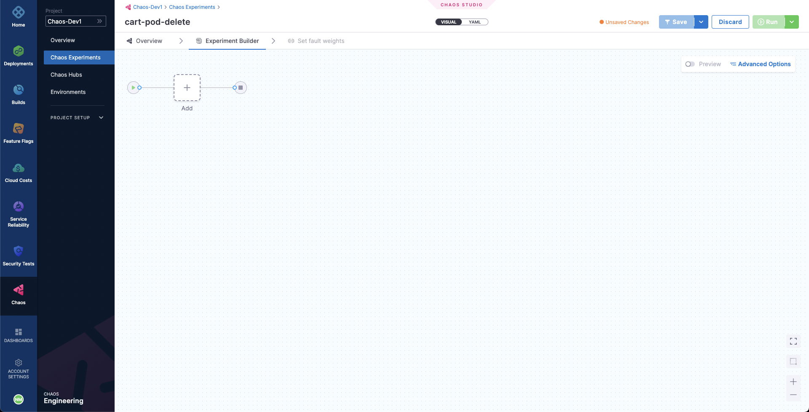
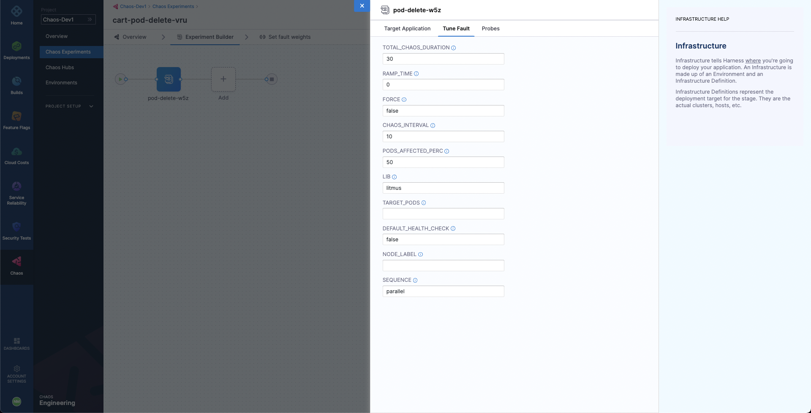
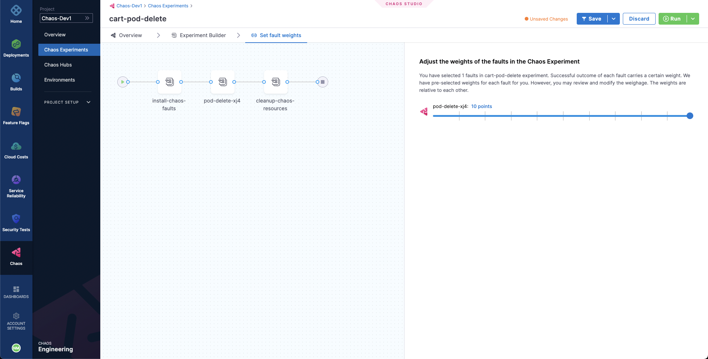
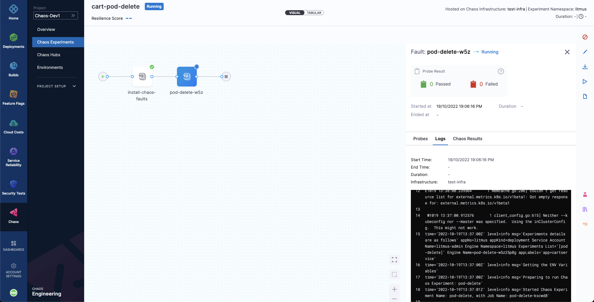
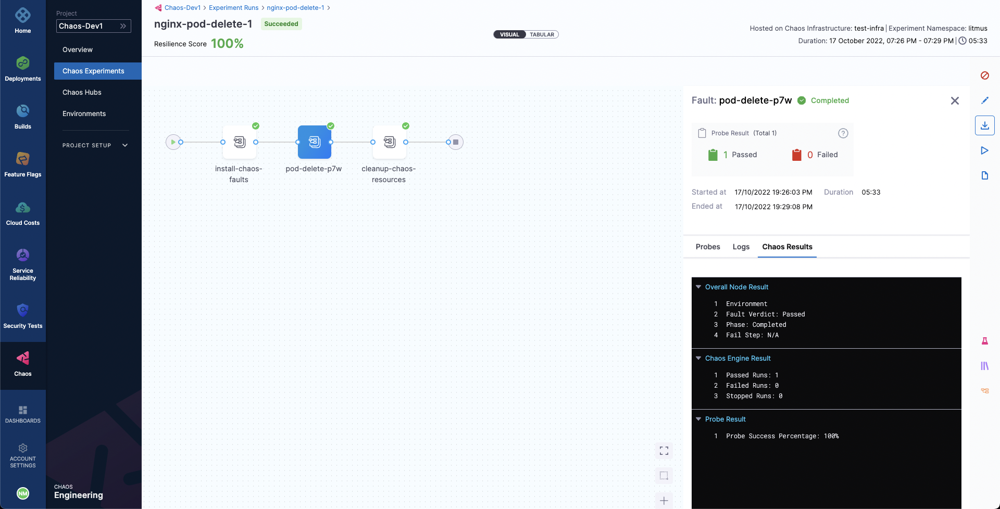

# Your First Chaos Experiment Run

## What is Chaos Engineering?
Cloud Native applications are, by definition, highly distributed, elastic, resistant to failure and loosely coupled. That's easy to say, and even diagram. But how do we validate that our applications will perform as expected under different failure conditions?
Enter Chaos Engineering!

Chaos Engineering is the discipline of experimenting on a software system in order to build confidence in the system's capability to withstand turbulent and unexpected conditions. Chaos Engineering is a great tool to help us find weaknesses and misconfiguration in our services. It is relevant for all types of systems (including the so called legacy applications and infrastructure), and particularly important for Cloud Native applications, which, due to their distributed and elastic nature, inherently carry multiple points of failure.

The standard chaos experimentation flow involves identifying the steady state of the system/application under test, hyopthesizing around the impact a particular fault or failure would cause, injecting this fault in a controlled manner (with a pre-determined and often minimal "blast radius"), validating whether the hypothesis is proven and taking appropriate action in case if it is not, i.e., a weakness is found.


Harness Chaos Engineering (HCE) helps simplify the chaos engineering practices for your organisation. To get started, create a new project or ask your administrator to add you to an existing project. Now, you can access the **Chaos** tab, where an overview of all the experiment runs can be observed.


## Add a Chaos Infrastructure

Next, we need to add the infrastructure resources so that Harness can access them. More specifically, we will create a new environment such that the target infrastructure resources can be added as part of it. Go to **Environments** in sidebar menu, and choose a **New Environment**. Add environment name, and optionally a description and tags. Select the environment type, **Production** or **Non-Production**. Finally, click on **Create** to add the new environment.


Once the environment is added, we can add different kinds of infrastructure to it. Here, we will add a Kubernetes infrastructure so that we can inject Kubernetes resource faults. Choose **New Chaos Infrastructure**.


Select **On New Infrastructures** and select **Continue**. Add a name to your chaos infrastructure and optionally a description and tags. Select **Next**.

After that, choose the mode of installation for Harness delegate. As a quick primer, Harness delegate is a remote agent for accessing your Kubernetes cluster resources and injecting faults into them as part of a chaos experiment. The **Cluster Wide** installation mode allows you to target resources across all the namespaces in your cluster while **Namespace Mode** installation restricts chaos injection to only the namespace in which the delegate will be installed. Choose **Cluster Wide** installation mode. By default, the delegate will install in the **litmus** namespace, but you can change it here. Then, choose **Next**.


Lastly, deploy your chaos infrastructure using the manifest provided. Choose **Download** and then run the given command in your terminal, provided that you have access to your Kubernetes cluster via [kubectl](https://kubernetes.io/docs/reference/kubectl/). Once done, choose **Next**.



It will take a while for the delegate to setup in the k8s cluster. Eventually all the pods in the `litmus` namespace should be in a running state, which you can optionally validate using the following command:
```bash
❯ kubectl get pods -n litmus
```

Otherwise, head to the created environment and as soon as the delegate is ready, the connection status should get reflected as `CONNECTED`.



## Constructing a Chaos Experiment

Now we are all ready to target our Kubernetes resources. Here, we will be executing the **Pod Delete** fault, which deletes the pods of a deployment, statefulset, daemonset, etc. to validate the resiliency of an application. You can use your own application pods as a target, however, we will use an Nginx deployment in the `default` namespace as the target application. 

Before we setup our chaos experiment, let us observe the target application deployment:
```bash
❯ kubectl get deployments

NAME    READY   UP-TO-DATE   AVAILABLE   AGE
nginx   1/1     1            1           7d22h
```

Hence, we have a Nginx deployment by the name of `nginx`, which has only one pod that we will be targetting using the Pod Delete fault:
```bash
❯ kubectl get pods

NAME                    READY   STATUS    RESTARTS   AGE
nginx-8f458dc5b-d7lkw   1/1     Running   0          121m
```

To create the chaos experiment, go to **Chaos Experiments** in the sidebar menu and choose **New Experiment**. Then, add the experiment name and optionally a description and tags. Then, choose the target infrastructure, which we created previously. Choose **Next**. In the Experiment Builder, choose **Blank Canvas** and select **Start with blank canvas**.



The Chaos Studio helps you to construct varied chaos experiments involving different kinds of chaos probes, faults and custom action steps. Let us use it to define our Pod Delete fault. Choose **Add**. From the **Enterprise Chaos Hub** select Pod Delete fault under the Kubernetes category.


Specify the target application namespace, type and label. HCE helps you to search for these entities from within the studio.


Then, choose the **Tune Fault** tab to configure the fault parameters. Here, we have defined the fault execution duration to be 30 seconds, with an interval of 5 seconds so that in every 5 seconds we will be deleting the nginx deployment pods. Lastly we have specified the pod affected percentage to be 100% so that all the deployment pods i.e. 1 pod will be deleted in each iteration of chaos.



Lastly, choose the **Probes** tab. Here, we have a default application healthcheck probe defined which validates the target application health before and after the fault injection to ensure that the application is unharmed due to the experiment. When done, simply close the overlay modal. We have added the Pod Delete fault now.


In the last step, choose the **Set Fault Weight** tab. Here, we can observe that the default weight for the fault is 10, which we can use for calculating the resiliency score for the experiment run. 



## Observing Chaos Execution and Evaluating the Run

When ready, start the experiment execution by selecting **Run**. You'll be able to observe the experiment added to the list of chaos experiments and it should be in a `Running` status. Choose **Current Execution** to get a detailed view.


Once the fault is running, we can check for the detailed view of the experiment. 



Parallely, we can also check for the status of the nginx pods:

```bash
❯ k get pods

NAME                    READY   STATUS    RESTARTS   AGE
nginx-8f458dc5b-htwc4   1/1     Running   0          6s
```

We can observe here that the age of the pod is only 6s, which is due to the Pod Delete fault deleting the experiment faults in successive iterations.

When the experiment execution concludes, we get a resiliency score of 100%. We can check the check the chaos result, where it can be observed that the fault verdict is **Passed** and the Probe Success Percentage is 100%, since the default probe execution in Edge mode validated the target application to be healthy before and after the chaos.



With that, we have successfully run our first chaos experiment!