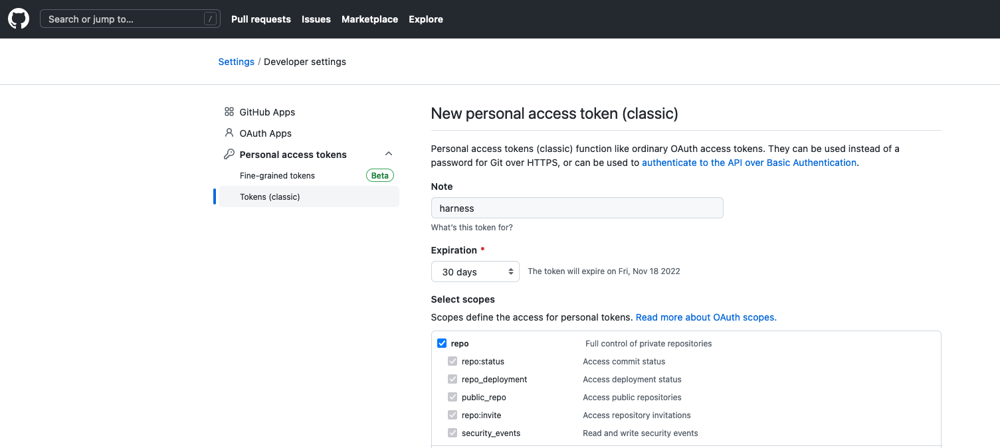
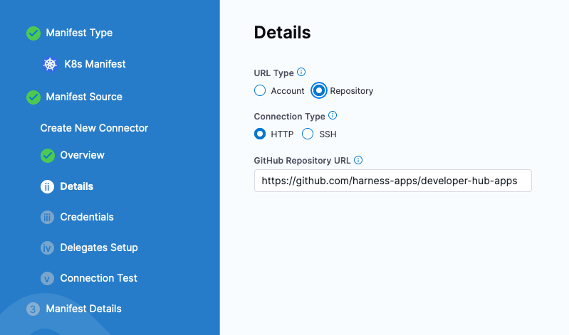
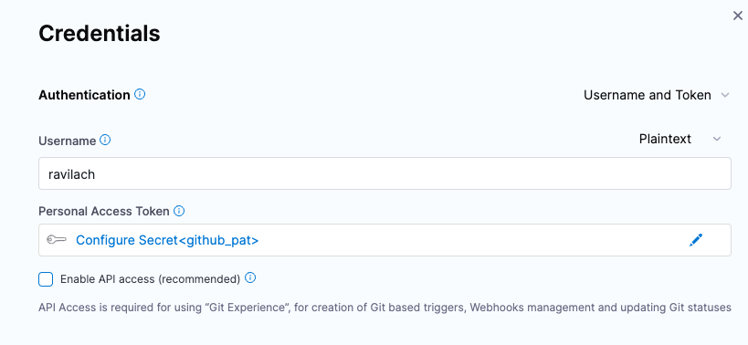
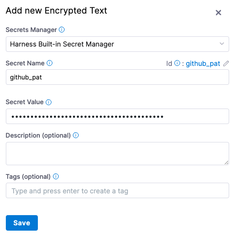
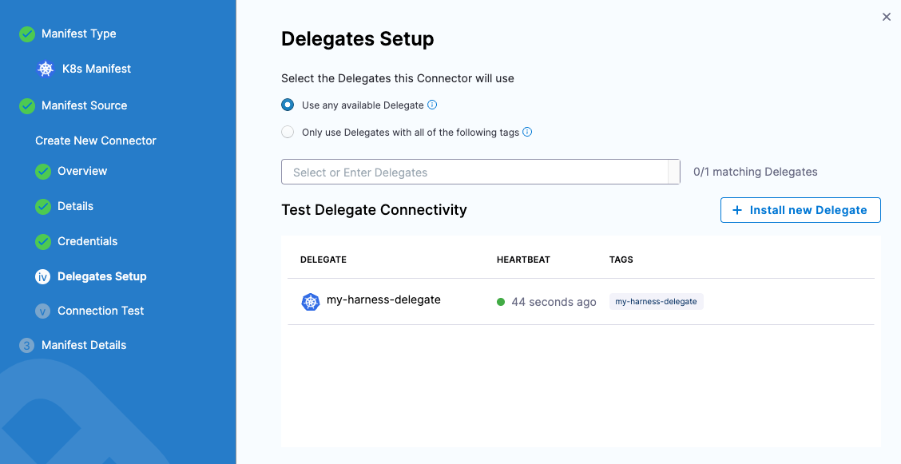

Harness will also need access to where to grab the Kubernetes manifests from GitHub.

#### GitHub Wiring

GitHub as of 2021 [requires token authentication](https://github.blog/2020-12-15-token-authentication-requirements-for-git-operations/) e.g. no more passwords for git operations. 

If you have not created a Personal Access Token before.

- GitHub -> Settings -> Developer Settings -> Personal Access Tokens
- Name: _harness_
- Scopes: repo 
- Expiration: 30 days

Make sure to copy down the token that is generated.

In the GitHub Connector Wizard, there are a few steps to wire in your GitHub credentials. For the example authenticate against the repo which is housing the manifest.

Manifest Name: my-gh-connector

Click Next. Now can set up authentication against the repository.

- URL Type: Repository
- Connection Type: HTTP
- GitHub URL: https://github.com/harness-apps/developer-hub-apps

Click Next and provide your GitHub Username and Personal Access Token which can be stored securely in the Harness Secrets Manager.

Click on the Personal Access Token to configure your PAT.

- Secrets Manager: _Harness Built-in Secret Manager_
- Secret Name: _github_pat_

Once you hit Save then Continue, select a Harness Delegate to run the operation on. If you have more than one Harness Delegate, can narrow the scope down or for the example, can “Use any available delegate” since this is the only one.

Click Save and Continue to validate the GitHub Connection.

